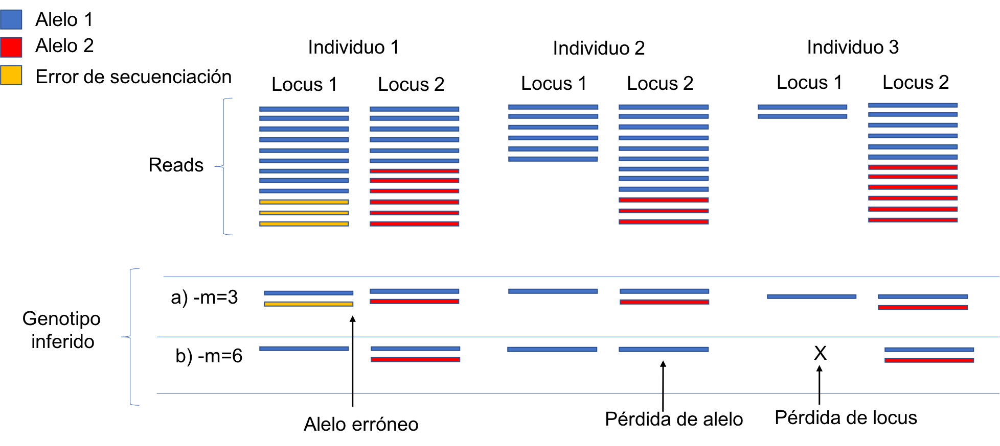
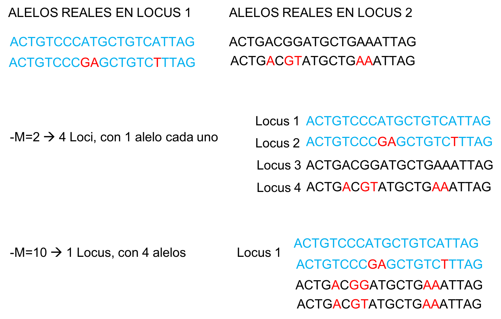
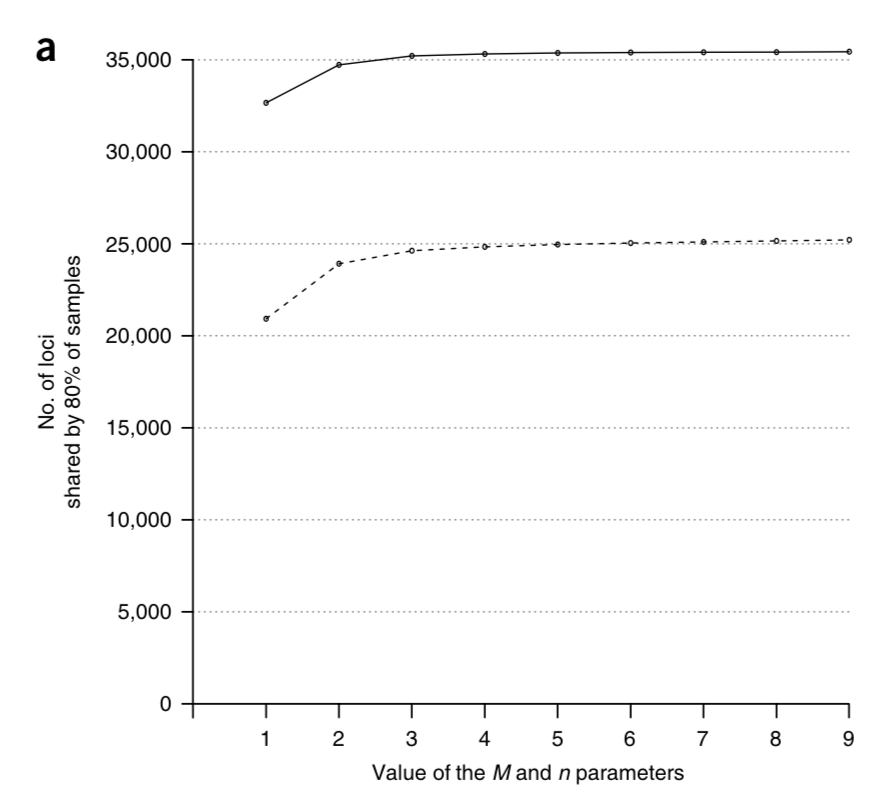

#Workshop Punta Arenas

## Pasos para alineamiento y llamado de variantes de Novo

1) [Process_radtags](http://catchenlab.life.illinois.edu/stacks/comp/process_radtags.php)
	Usado para demultiplexar y corregir o hacer primer filtro de calidad de los datos

2) [ustacks](http://catchenlab.life.illinois.edu/stacks/comp/ustacks.php)
	Alineamiento dentro de cada individuo (se forman "stacks")

3) [cstacks](http://catchenlab.life.illinois.edu/stacks/comp/cstacks.php)
	Se genera un "catálogo" que contiene los alelos de la poblacion. Es un tipo de referencia que se genera para luego compararlo con cada individuo.

4) stacks](http://catchenlab.life.illinois.edu/stacks/comp/sstacks.php)
	Los alelos de cada individuo detectados en ustacks, se comparan y se buscan en el catalogo

5) [tsv2bam](http://catchenlab.life.illinois.edu/stacks/comp/tsv2bam.php)
	Simplemente un cambio en el formato de los datos y archivos

6) [gstacks](http://catchenlab.life.illinois.edu/stacks/comp/gstacks.php)

7) [populations](http://catchenlab.life.illinois.edu/stacks/comp/populations.php)

## El test de Novo

[denovo_map.pl](http://catchenlab.life.illinois.edu/stacks/comp/denovo_map.php)

Parámetros más importantes quí](http://catchenlab.life.illinois.edu/stacks/param_tut.php):

Ahondando un poco más:

El parámetro m:

El parámetro M:

 Lo que se propone es hacer corridas de optimización y buscar la combinación de paramétros que maximicen el número de loci compartidos en el 80% de la población.

Algo así:
 

